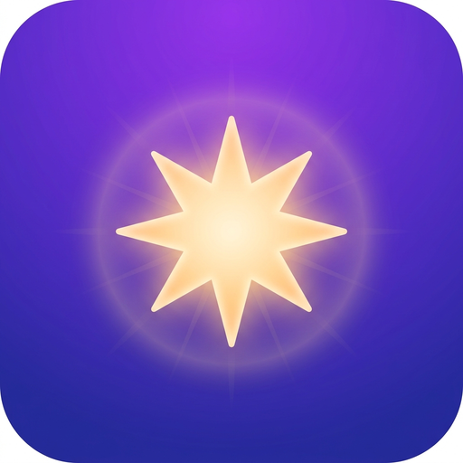

<div align="center">



# ✨ Lumina Daily

**매일 당신의 하루를 채우는 지혜 한 조각**

[](https://github.com/jeiel85/lumina-daily/actions)
[](https://github.com/jeiel85/lumina-daily/releases/latest)
[](https://github.com/jeiel85/lumina-daily/releases/latest)
[](https://firebase.google.com)
[](https://deepmind.google/technologies/gemini/)

[📲 APK 다운로드](#-download) · [🌐 웹앱](https://jeiel85.github.io/lumina-daily/) · [🔒 개인정보처리방침](https://jeiel85.github.io/lumina-daily/privacy-policy.html)

</div>

---

## 📖 소개

Lumina Daily는 **Google Gemini AI**가 큐레이션한 전 세계의 명언과 지혜를 매일 아름다운 이미지와 함께 전달하는 앱입니다. 단순한 명언 앱을 넘어, AI가 그 속에 담긴 지혜의 깊이를 해설하고 당신의 삶에 적용할 수 있는 성찰을 제공합니다.

<br />

## ✨ 주요 기능

<table>
  <tr>
    <td width="50%">
      <h3>📖 오늘의 명언</h3>
      세계 각지의 철학자, 작가, 위인들의 명언을 매일 새롭게 만나보세요.
    </td>
    <td width="50%">
      <h3>🧠 AI 심층 해설</h3>
      Google Gemini가 명언의 본질을 분석하고 오늘의 삶에 적용하는 방법을 제시합니다.
    </td>
  </tr>
  <tr>
    <td width="50%">
      <h3>🎨 감성 배경 이미지</h3>
      명언의 분위기에 최적화된 이미지가 실시간으로 생성되어 몰입감을 더합니다.
    </td>
    <td width="50%">
      <h3>🔔 매일 알림</h3>
      매일 정해진 시간에 오늘의 명언 알림을 받아보세요.
    </td>
  </tr>
  <tr>
    <td width="50%">
      <h3>🌐 4개 국어 지원</h3>
      한국어 · English · 日本語 · 中文을 언제든지 전환하여 이용하세요.
    </td>
    <td width="50%">
      <h3>📚 명언 아카이브</h3>
      지나간 명언을 언제든지 다시 꺼내볼 수 있습니다.
    </td>
  </tr>
</table>

<br />

## 🛠 기술 스택

<div align="center">


</div>

<br />

## 📲 Download

<div align="center">

최신 릴리즈에서 APK를 다운로드하여 설치하세요.

[](https://github.com/jeiel85/lumina-daily/releases/latest)

**설치 방법**
1. 위 버튼을 눌러 `app-release.apk` 다운로드
2. 안드로이드 설정 → **알 수 없는 앱 설치** 허용
3. APK 파일 실행하여 설치

</div>

<br />

## 🚀 로컬 개발

```bash
# 의존성 설치
npm install

# 개발 서버 실행
npm run dev

# 빌드
npm run build

# 테스트
npm test
```

### 환경 변수 설정

`.env.example`을 복사하여 `.env` 파일을 생성하고 Firebase 설정값을 입력하세요.

```bash
cp .env.example .env
```

<br />

## 📦 릴리즈

버전 태그를 푸시하면 GitHub Actions가 자동으로 릴리즈 APK를 빌드하고 배포합니다.

```bash
git tag v1.0.6
git push origin v1.0.6
```

<br />

## 🌍 링크

| | URL |
|--|-----|
| 🌐 랜딩 페이지 | https://jeiel85.github.io/lumina-daily/ |
| 🔒 개인정보처리방침 | https://jeiel85.github.io/lumina-daily/privacy-policy.html |

<br />

---

<div align="center">

© 2026 Lumina Daily. All rights reserved.

</div>
